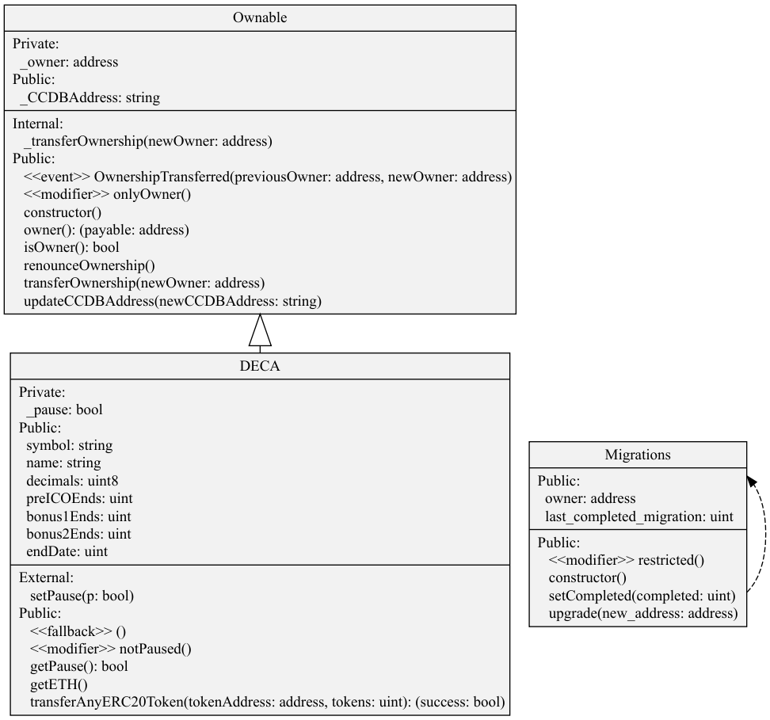

Decentralized Carbon Credits ERC20
===

[](https://gitter.im/deca-currency/community) 
[](https://www.gnu.org/licenses/gpl-3.0)

Decentralized Carbon Credits in an ERC20 by Neetsec

## Table of Contents

[[_TOC_]] 

## DECA Project Tree
```sh
|-- LICENSE
|-- README.md
|-- contracts
|-- build
|   |-- contracts
|       |-- Context.json
|       |-- DECA.json
|       |-- ERC20.json
|       |-- IERC20.json
|       |-- Migrations.json
|       |-- Ownable.json
|       `-- SafeMath.json
|   |-- DECA.sol
|   `-- Migrations.sol
|-- migrations
|   |-- 1_initial_migration.js
|   `-- 2_deploy_contracts.js
|-- package.json
|-- run-rpc.sh
|-- test
|   `-- DECA.js
|-- truffle.js
|-- .gitignore
|-- .gitlab-ci.yml
```

## Requirements

* Node.js >= 12
* @openzeppelin/contracts = 2.4.0 

#### Global install
* ganache-cli >= 6.9.1 
* truffle = 5.1.3

## Instalation

**Download and install Node.js v12.x and npm.**

* Node.js

**Using Ubuntu**

```sh
  $ curl -sL https://deb.nodesource.com/setup_12.x | sudo -E bash -
  $ sudo apt-get install -y nodejs
```
**Using Debian, as root**

```sh
 $ curl -sL https://deb.nodesource.com/setup_12.x | bash - 
 $ apt-get install -y nodejs
```

**Clone the repo**

```sh
 $ git clone https://gitlab.com/deca-currency/dcc.git
 $ cd dcc
```

**Install the dependencies**

```sh
 $ npm install
```

**Install ganache-cli**
```sh
 $ sudo npm install -g ganache-cli
```

**Install truffle**

```sh
 $ sudo npm install -g truffle@5.1.3
```

## Testing the Smart Contract:
- can see the test in pipelines or you can run it locally

#### Running locally
- open shell and execute "./run-rpc.sh" (remember change /usr/local/bin/ganache-cli to your path)
```sh
$ ./run-rpc.sh
```

- open second shell, and execute 

```sh
$ truffle tests
```


## Class Diagram ERC20 Token generated with [sol2uml](https://github.com/naddison36/sol2uml)

<p align="center">
  
</p>

## Specification

### Methods

Apart from the [ERC20 standard](https://eips.ethereum.org/EIPS/eip-20) methods that our token complies, we introduce some
improvements, either for security or others that match DECA specific requirements.

**Notes:**

* The following specifications use syntax from Solidity (0.5.12)

#### owner 

Returns the address of the current owner.

```sh
function owner() public view returns (address payable)
```

#### isOwner 

Returns true if the caller is the current owner.

```sh
function isOwner() public view returns (bool)
```

#### transferOwnership 

Can only be called by the current owner.

```sh
function transferOwnership(address payable newOwner) public onlyOwner 
```

#### updateCCDBAddress
Updates the official orbitDB address for carbon credits.
    
Can Only be updated by the current owner

```sh
function updateCCDBAddress(string memory newCCDBAddress) public onlyOwner 
```

#### transferAnyERC20Token 

Owner can transfer out any accidentally sent ERC20 tokens

```sh
function transferAnyERC20Token(address payable tokenAddress, uint tokens) public onlyOwner returns (bool success)
```

#### getETH 

Close down the ICO and claim the Ether.

```sh
function getETH() public onlyOwner { require(now >= endDate); owner().transfer(address(this).balance); }
```

## DECA Promotion Dates 

Now, based on the total Ethereums we got by the ICO  (ETHTS) 
and considering our promodates which are:

| PROMO  | TIME (weeks) | DECA TOKENS PER ETH |
|--------|--------------|---------------------|
| preICO | 1            | 300                 |
| Bonus1 | 2            | 275                 |
| Bonus2 | 3            | 250                 |
| ICO    | 5            | 225                 |
